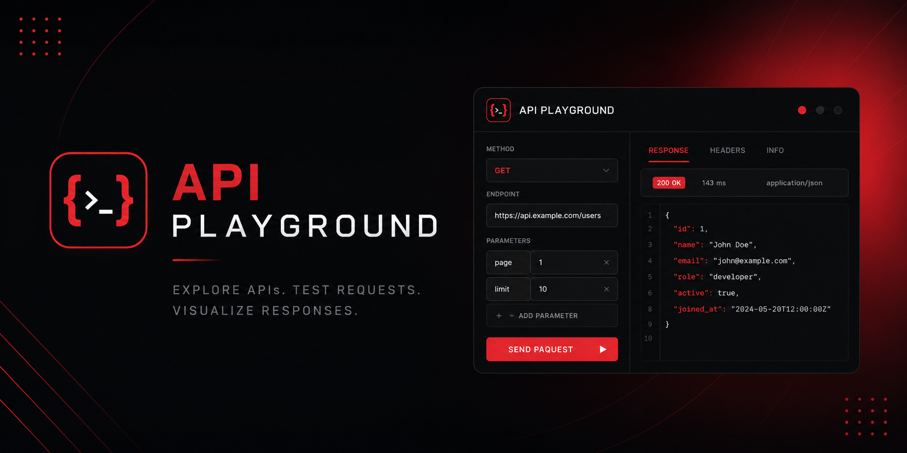

# API Playground

<p align="center">

  

</p>

<p align="center">
  Uma plataforma web para explorar, executar e visualizar requisições HTTP de forma simples e intuitiva.
</p>


## Sumário

- [Sobre o projeto](#sobre-o-projeto)
- [Contexto e motivação](#contexto-e-motivação)
- [Problema](#problema)
- [Solução proposta](#solução-proposta)
- [Objetivo](#objetivo)
- [Como funciona](#como-funciona)
- [Arquitetura](#arquitetura)
- [Fluxo da aplicação](#fluxo-da-aplicação)
- [Tecnologias](#tecnologias)
- [Estrutura do projeto](#estrutura-do-projeto)
- [Consumo de APIs](#consumo-de-apis)
- [Métodos HTTP](#métodos-http)
- [Tratamento de respostas](#tratamento-de-respostas)
- [Tratamento de erros](#tratamento-de-erros)
- [Interface](#interface)
- [Responsabilidades](#responsabilidades)
- [Decisões técnicas](#decisões-técnicas)
- [Escopo inicial](#escopo-inicial)
- [Evolução do projeto](#evolução-do-projeto)
- [Conclusão](#conclusão)
- [Autores](#autores)

---

# Sobre o projeto

O **API Playground** é uma aplicação web desenvolvida para facilitar a exploração e o consumo de APIs públicas através de uma interface gráfica.

A proposta é permitir que o usuário selecione uma API, configure uma requisição, envie a solicitação e visualize a resposta retornada pelo servidor sem precisar escrever código ou utilizar ferramentas externas.

O projeto foi concebido com foco em **simplicidade, organização e aprendizado prático**, utilizando tecnologias fundamentais da Web.

> **API Playground** não tem como objetivo substituir ferramentas profissionais como Postman ou Insomnia. A proposta é oferecer uma experiência mais simples e didática para explorar o funcionamento de APIs e requisições HTTP.

---

# Contexto e motivação

Durante o desenvolvimento de aplicações web, o consumo de APIs é uma atividade recorrente.

Uma aplicação pode depender de serviços externos para obter:

- informações geográficas;
- dados de usuários;
- filmes e séries;
- jogos;
- informações sobre países;
- dados meteorológicos;
- moedas;
- imagens;
- informações públicas em geral.

Apesar de ser uma tarefa comum, compreender o caminho completo entre uma aplicação e uma API exige conhecimento de diversos conceitos.

```text
Aplicação
    |
    | HTTP Request
    v
Servidor / API
    |
    | Processamento
    v
HTTP Response
    |
    | JSON
    v
Aplicação
    |
    v
Interface
```

O projeto nasceu com a intenção de transformar esse processo em algo **visual, acessível e compreensível**.

---

# Problema

Ferramentas de desenvolvimento de APIs são extremamente úteis, porém podem apresentar uma curva de aprendizado maior para quem está começando.

Além disso, quando alguém deseja apenas testar uma API pública, muitas vezes precisa:

1. encontrar a documentação;
2. descobrir o endpoint;
3. entender os parâmetros;
4. configurar a requisição;
5. interpretar a resposta;
6. utilizar uma ferramenta externa.

O problema que o projeto pretende abordar é:

> **Como tornar a exploração de APIs públicas mais simples e visual, sem esconder o funcionamento das requisições HTTP?**

---

# Solução proposta

O API Playground centraliza esse processo em uma única interface.

O usuário poderá selecionar uma API disponível no sistema e construir uma requisição através de elementos visuais.

```text
┌──────────────────────────────────────────────┐
│                API PLAYGROUND                │
├──────────────────────────────────────────────┤
│                                              │
│  API                                         │
│  [ Countries API                       ▼ ]   │
│                                              │
│  Method                                      │
│  [ GET ]                                     │
│                                              │
│  Endpoint                                    │
│  [ https://api.example.com/countries     ]   │
│                                              │
│  Parameters                                  │
│  ┌──────────────┬─────────────────────────┐  │
│  │ Key          │ Value                   │  │
│  ├──────────────┼─────────────────────────┤  │
│  │ country      │ Brazil                  │  │
│  └──────────────┴─────────────────────────┘  │
│                                              │
│             [ SEND REQUEST ]                │
│                                              │
└──────────────────────────────────────────────┘
```

Após a execução, o sistema apresenta as informações da resposta.

```text
Status: 200 OK
Response Time: 143 ms
Content Type: application/json

{
    "name": "Brazil",
    "capital": "Brasília",
    "population": 216000000
}
```

A resposta poderá posteriormente ser apresentada em diferentes formatos.

---

# Objetivo

O objetivo principal é desenvolver uma aplicação capaz de:

- listar APIs disponíveis;
- permitir a seleção de uma API;
- configurar requisições;
- executar requisições HTTP;
- receber respostas;
- interpretar JSON;
- apresentar informações da resposta;
- informar status HTTP;
- medir o tempo da requisição;
- tratar erros;
- oferecer diferentes formas de visualização dos dados.

Do ponto de vista educacional, o projeto também busca consolidar conhecimentos sobre:

| Conceito | Aplicação no projeto |
|---|---|
| HTTP | Comunicação entre aplicação e servidor |
| REST | Estrutura das APIs consumidas |
| Fetch API | Execução das requisições |
| JSON | Formato dos dados |
| Async/Await | Operações assíncronas |
| DOM | Atualização da interface |
| JavaScript Modules | Organização do código |
| Error Handling | Tratamento de falhas |
| Git | Controle de versão |
| Responsividade | Adaptação da interface |

---

# Como funciona

O funcionamento da aplicação pode ser dividido em cinco etapas principais.

## 1. Seleção da API

O usuário escolhe uma das APIs disponibilizadas pelo projeto.

Cada API possui informações como:

```javascript
{
    name: "Countries API",
    description: "Informações sobre países",
    baseUrl: "https://api.example.com",
    method: "GET"
}
```

---

## 2. Configuração da requisição

Depois de selecionar a API, o usuário poderá configurar os dados necessários para realizar a requisição.

Dependendo do método HTTP, poderão existir:

- URL;
- parâmetros;
- headers;
- body.

No primeiro momento, o projeto terá foco em requisições `GET`.

---

## 3. Execução

Ao enviar a requisição, o JavaScript utiliza a `Fetch API`.

Exemplo simplificado:

```javascript
const response = await fetch(url);
const data = await response.json();
```

A aplicação então processa o resultado.

---

## 4. Processamento

A resposta recebida pelo servidor será analisada.

Informações como:

```text
HTTP Status
Status Message
Response Time
Content Type
Response Data
```

serão disponibilizadas para a camada de interface.

---

## 5. Visualização

A interface apresenta os dados para o usuário.

A visualização principal será o JSON original.

Posteriormente, a aplicação poderá oferecer:

```text
[ JSON ]    [ TABLE ]    [ CARDS ]
```

Cada formato possui uma finalidade diferente.

---

# Arquitetura

O projeto será organizado separando a comunicação com APIs da camada responsável pela apresentação dos dados.

```text
                         API PLAYGROUND
                               |
              +----------------+----------------+
              |                                 |
              v                                 v
         API LAYER                            UI LAYER
              |                                 |
       API Client                          Components
              |                                 |
          Services                         Rendering
              |                                 |
              +----------------+----------------+
                               |
                               v
                         User Interface
```

Essa separação é importante porque permite que cada parte do projeto tenha uma responsabilidade específica.

## API Layer

Responsável por:

- comunicação HTTP;
- endpoints;
- parâmetros;
- headers;
- parsing das respostas;
- tratamento de erros;
- serviços relacionados às APIs.

## UI Layer

Responsável por:

- HTML;
- componentes;
- eventos;
- apresentação dos dados;
- estados visuais;
- responsividade.

---

# Fluxo da aplicação

O fluxo principal pode ser representado da seguinte maneira:

```text
                    Usuário
                       |
                       v
                Seleciona API
                       |
                       v
               Configura Request
                       |
                       v
                  [ SEND ]
                       |
                       v
                Request Builder
                       |
                       v
                  API Client
                       |
                       v
                 HTTP Request
                       |
                       v
                    API
                       |
                       v
                 HTTP Response
                       |
                       v
                Response Service
                       |
              +--------+--------+
              |                 |
              v                 v
          Success             Error
              |                 |
              v                 v
       Response Viewer      Error Viewer
              |
              v
             UI
```

---

# Tecnologias

O projeto utiliza tecnologias nativas da Web.

| Tecnologia | Utilização |
|---|---|
| HTML5 | Estrutura da aplicação |
| CSS3 | Estilização e layout |
| JavaScript | Lógica da aplicação |
| Fetch API | Comunicação HTTP |
| JSON | Manipulação dos dados |
| Git | Controle de versão |
| GitHub | Hospedagem e colaboração |

## Por que JavaScript puro?

O projeto inicialmente não utilizará frameworks como React, Vue ou Angular.

A decisão é intencional.

O objetivo é compreender o funcionamento fundamental de uma aplicação Web antes de adicionar abstrações de frameworks.

Dessa maneira, conceitos como:

```javascript
fetch()
async
await
Promise
DOM
EventListener
Modules
try
catch
```

serão utilizados diretamente.

---

# Estrutura do projeto

A estrutura inicial será organizada da seguinte maneira:

```text
api-playground/
│
├── index.html
├── README.md
│
├── assets/
│   ├── banner.png
│   └── images/
│
├── css/
│   ├── reset.css
│   ├── variables.css
│   ├── global.css
│   ├── layout.css
│   ├── components.css
│   └── responsive.css
│
└── js/
    │
    ├── app.js
    │
    ├── api/
    │   ├── client.js
    │   ├── countries.js
    │   ├── games.js
    │   └── movies.js
    │
    ├── services/
    │   ├── requestService.js
    │   └── responseService.js
    │
    ├── components/
    │   ├── apiCard.js
    │   ├── requestBuilder.js
    │   ├── responseViewer.js
    │   ├── loader.js
    │   └── errorMessage.js
    │
    └── utils/
        ├── formatJson.js
        ├── formatResponse.js
        └── validators.js
```

---

# Consumo de APIs

O consumo das APIs será centralizado sempre que possível.

Um cliente HTTP genérico poderá ser criado para evitar repetição de código.

Exemplo:

```javascript
export async function request(url, options = {}) {
    const startTime = performance.now();

    const response = await fetch(url, options);

    const endTime = performance.now();

    const data = await response.json();

    return {
        data,
        status: response.status,
        statusText: response.statusText,
        responseTime: endTime - startTime
    };
}
```

Dessa forma, as APIs específicas poderão reutilizar o mesmo mecanismo.

---

# Serviços

Cada API poderá possuir um serviço próprio.

Exemplo:

```javascript
import { request } from "./client.js";

export async function getCountry(country) {
    const url = `https://api.example.com/country/${country}`;

    return await request(url);
}
```

A interface não precisa conhecer os detalhes do endpoint.

Ela apenas solicita os dados:

```javascript
const country = await getCountry("Brazil");
```

Essa abordagem reduz o acoplamento entre as camadas.

---

# Contrato entre API e Interface

Uma das decisões importantes do projeto é estabelecer um contrato claro entre a camada de dados e a interface.

A API Layer deverá fornecer informações em um formato previsível.

Exemplo:

```javascript
{
    data: {},
    status: 200,
    statusText: "OK",
    responseTime: 143
}
```

A interface poderá então trabalhar com esse objeto sem precisar conhecer:

- a URL original;
- os parâmetros internos;
- a implementação do `fetch`;
- a API utilizada;
- detalhes de autenticação.

Isso permite que as duas partes do projeto evoluam de maneira independente.

---

# Métodos HTTP

A primeira versão terá como foco:

```text
GET
```

Posteriormente poderão ser adicionados:

| Método | Finalidade |
|---|---|
| GET | Obter dados |
| POST | Criar dados |
| PUT | Substituir dados |
| PATCH | Atualizar parcialmente |
| DELETE | Remover dados |

Exemplo de uma requisição `POST`:

```javascript
const response = await fetch(url, {
    method: "POST",
    headers: {
        "Content-Type": "application/json"
    },
    body: JSON.stringify({
        name: "Gabriel"
    })
});
```

Essa funcionalidade será adicionada apenas após a estrutura básica estar consolidada.

---

# Query Parameters

Para requisições que utilizam parâmetros, será utilizada a API nativa `URLSearchParams`.

Exemplo:

```javascript
const params = new URLSearchParams({
    page: "1",
    limit: "10",
    search: "Brazil"
});

const url = `https://api.example.com/users?${params}`;
```

Resultado:

```text
https://api.example.com/users?page=1&limit=10&search=Brazil
```

Essa abordagem evita a construção manual de URLs complexas.

---

# Headers

Em versões futuras, será possível adicionar headers através da interface.

Exemplo:

```javascript
const headers = {
    "Content-Type": "application/json",
    "Authorization": "Bearer token"
};
```

O Request Builder será responsável por transformar os campos preenchidos pelo usuário em um objeto compatível com o `fetch`.

---

# Response Viewer

O Response Viewer será responsável por apresentar o resultado da requisição.

A visualização inicial será baseada em JSON.

Exemplo:

```json
{
    "id": 1,
    "name": "Gabriel",
    "active": true,
    "roles": [
        "developer",
        "student"
    ]
}
```

O JSON deverá ser formatado para facilitar a leitura.

---

# Visualização em tabela

Quando a estrutura dos dados permitir, uma resposta como:

```json
[
    {
        "id": 1,
        "name": "Gabriel"
    },
    {
        "id": 2,
        "name": "Maria"
    }
]
```

poderá ser transformada em:

| ID | Name |
|---:|---|
| 1 | Gabriel |
| 2 | Maria |

O sistema deverá identificar estruturas compatíveis antes de gerar a tabela.

---

# Visualização em cards

Determinadas respostas podem ser mais bem apresentadas através de cards.

Exemplo:

```text
┌─────────────────────────┐
│ User                    │
├─────────────────────────┤
│ ID: 1                   │
│                         │
│ Name: Gabriel           │
│                         │
│ Status: Active          │
└─────────────────────────┘
```

Essa funcionalidade permitirá que o projeto não fique limitado à simples exibição de JSON.

---

# Status HTTP

As respostas deverão apresentar o status HTTP recebido.

Exemplo:

```text
200 OK
```

Alguns códigos importantes:

| Código | Significado |
|---:|---|
| 200 | OK |
| 201 | Created |
| 204 | No Content |
| 400 | Bad Request |
| 401 | Unauthorized |
| 403 | Forbidden |
| 404 | Not Found |
| 429 | Too Many Requests |
| 500 | Internal Server Error |
| 503 | Service Unavailable |

O objetivo não é apenas mostrar o código, mas utilizar essas informações para determinar o comportamento da interface.

---

# Tempo de resposta

O projeto também poderá medir o tempo necessário para receber a resposta.

Exemplo:

```javascript
const start = performance.now();

const response = await fetch(url);

const end = performance.now();

const responseTime = end - start;
```

Resultado:

```text
Status: 200 OK
Response Time: 143 ms
```

Esse dado será utilizado principalmente para fins informativos.

---

# Tratamento de erros

Falhas são consideradas parte normal de uma aplicação que depende de serviços externos.

Por isso, o sistema deverá tratar diferentes tipos de problemas.

## Erros HTTP

```text
404 Not Found
401 Unauthorized
429 Too Many Requests
500 Internal Server Error
```

## Erros de rede

```text
Network Error
Failed to fetch
```

## Dados inválidos

```text
Invalid JSON
Unexpected response format
```

A aplicação deverá evitar apresentar erros técnicos diretamente ao usuário quando uma mensagem mais clara puder ser exibida.

---

# Estados da interface

A aplicação terá estados bem definidos.

```text
IDLE
  |
  v
LOADING
  |
  +-------> SUCCESS
  |
  +-------> ERROR
```

## Idle

Nenhuma requisição foi realizada.

```text
No request executed.
```

## Loading

A requisição está sendo processada.

```text
Sending request...
```

## Success

A API respondeu corretamente.

```text
200 OK
Request completed successfully.
```

## Error

A requisição falhou.

```text
Request failed.
404 Not Found
```

Essa separação evita que o usuário fique sem feedback durante operações assíncronas.

---

# Interface

A interface será desenvolvida com foco em clareza.

A estrutura visual deverá priorizar:

1. seleção da API;
2. configuração da requisição;
3. execução;
4. resultado.

Uma representação conceitual:

```text
┌────────────────────────────────────────────────────┐
│                    API PLAYGROUND                  │
├────────────────────────────────────────────────────┤
│                                                    │
│  APIs                    REQUEST                   │
│  ─────────────────       ───────────────────────   │
│                                                    │
│  Countries               GET                       │
│  Games                   https://api.example.com   │
│  Movies                                            │
│                          Parameters                │
│                                                    │
│                          [ key ] [ value ]         │
│                                                    │
│                          [ SEND REQUEST ]          │
│                                                    │
├────────────────────────────────────────────────────┤
│                                                    │
│  RESPONSE                                          │
│                                                    │
│  200 OK                    143 ms                  │
│                                                    │
│  [ JSON ] [ TABLE ] [ CARDS ]                     │
│                                                    │
│  {                                                 │
│      "id": 1,                                      │
│      "name": "Gabriel"                             │
│  }                                                 │
│                                                    │
└────────────────────────────────────────────────────┘
```

---

# Responsabilidades

O desenvolvimento será dividido entre dois desenvolvedores.

## Desenvolvimento da API e lógica

Responsável principalmente por:

- integração com APIs;
- `fetch`;
- métodos HTTP;
- parâmetros;
- headers;
- tratamento de respostas;
- tratamento de erros;
- serviços;
- validações;
- transformação dos dados.

Principais diretórios:

```text
js/api/
js/services/
js/utils/
```

---

## Desenvolvimento da interface

Responsável principalmente por:

- HTML;
- CSS;
- layout;
- responsividade;
- componentes visuais;
- estados da interface;
- animações;
- apresentação das respostas.

Principais diretórios:

```text
index.html
css/
js/components/
```

Apesar da divisão, decisões estruturais deverão ser discutidas entre os desenvolvedores para manter consistência no projeto.

---

# Decisões técnicas

## JavaScript sem framework

A ausência de um framework é proposital.

O projeto pretende demonstrar domínio dos fundamentos da Web, principalmente:

```text
DOM
Fetch
Promises
Async/Await
Modules
Events
HTTP
JSON
```

---

## Separação de responsabilidades

A interface não deverá executar diretamente chamadas específicas de APIs sempre que houver uma camada de serviço adequada.

Evitar:

```javascript
button.addEventListener("click", async () => {
    const response = await fetch("https://api.example.com/users");

    // Toda a lógica da aplicação aqui
});
```

Preferir:

```javascript
button.addEventListener("click", async () => {
    const result = await getUsers();

    renderUsers(result);
});
```

Essa separação facilita manutenção e testes.

---

# Segurança e limitações

O projeto será executado inicialmente no lado do cliente.

Isso significa que algumas APIs podem possuir limitações relacionadas a:

- CORS;
- autenticação;
- rate limits;
- exposição de tokens;
- restrições de origem.

Tokens privados ou credenciais sensíveis não deverão ser armazenados diretamente no código-fonte público.

Uma API que exige uma chave privada poderá necessitar posteriormente de um backend intermediário.

---

# APIs utilizadas

As APIs utilizadas serão documentadas nesta seção conforme forem integradas.

| API | Categoria | Método | Autenticação | Utilização |
|---|---|---|---|---|
| A definir | A definir | GET | A definir | A definir |
| A definir | A definir | GET | A definir | A definir |
| A definir | A definir | GET | A definir | A definir |

Cada API deverá ser analisada antes da integração considerando:

- disponibilidade;
- documentação;
- CORS;
- limites de requisições;
- estabilidade;
- necessidade de autenticação;
- formato da resposta.

---

# Escopo inicial

A primeira versão do projeto será propositalmente limitada.

O MVP deverá contemplar:

```text
[ ] Catálogo de APIs
[ ] Seleção de API
[ ] Requisição GET
[ ] Query Parameters
[ ] Execução de requisição
[ ] Status HTTP
[ ] Tempo de resposta
[ ] Visualização JSON
[ ] Loading State
[ ] Error State
[ ] Layout responsivo
```

Funcionalidades como autenticação avançada, collections e ambientes não fazem parte da primeira versão.

---

# Evolução do projeto

Depois da primeira versão funcional, o projeto poderá evoluir gradualmente.

## Versão 1.0

```text
GET
Query Parameters
JSON Viewer
Status HTTP
Response Time
Error Handling
```

## Versão 2.0

```text
POST
PUT
PATCH
DELETE
Headers
Request Body
JSON Validation
```

## Versão 3.0

```text
Table Viewer
Card Viewer
Request History
Favorites
Local Storage
```

## Possíveis versões futuras

```text
API Collections
Environment Variables
Authentication
Import / Export Requests
API Documentation
Request Templates
Advanced Response Viewer
```

A evolução deverá ocorrer somente após a arquitetura básica estar estável.

---

# Filosofia do projeto

O API Playground foi pensado para ser um projeto pequeno em tecnologia, mas amplo em aprendizado.

A escolha de não utilizar frameworks no início permite observar diretamente o funcionamento das principais ferramentas utilizadas por aplicações Web.

O projeto também foi estruturado para que a camada de API e a interface possam evoluir independentemente.

O princípio central é:

> **Simplificar a experiência sem esconder a tecnologia.**

O usuário deverá conseguir realizar uma requisição com poucos passos, enquanto o código continuará demonstrando claramente o que acontece entre a aplicação e o servidor.

---

# Conclusão

O **API Playground** é uma aplicação voltada para exploração de APIs através de uma interface visual.

Sua proposta combina dois objetivos:

| Objetivo | Resultado esperado |
|---|---|
| Educacional | Compreender APIs, HTTP e JavaScript |
| Prático | Criar uma ferramenta funcional |
| Arquitetural | Separar dados e apresentação |
| Colaborativo | Permitir desenvolvimento em dupla |
| Portfólio | Demonstrar conhecimentos de desenvolvimento Web |

O projeto começa com uma proposta simples: **realizar e visualizar requisições HTTP**.

A partir dessa base, sua arquitetura permite adicionar novos métodos HTTP, diferentes formas de visualização, histórico, favoritos e outros recursos sem alterar completamente a estrutura existente.

A intenção final é construir uma aplicação que seja simultaneamente **simples para utilizar, organizada para desenvolver e clara para estudar**.

---

# Autores

Projeto desenvolvido por:

| Desenvolvedor | Responsabilidade |
|---|---|
| Desenvolvedor 1 | API, lógica e integração |
| Desenvolvedor 2 | Interface, HTML e CSS |

---

# Status

```text
Project: API Playground
Version: 0.1.0
Status: In Development
```

---

<p align="center">
  <strong>API Playground</strong>
  <br>
  Explore. Request. Understand.
  <small>powered by gabs-dg & angel developers</small>
</p>
